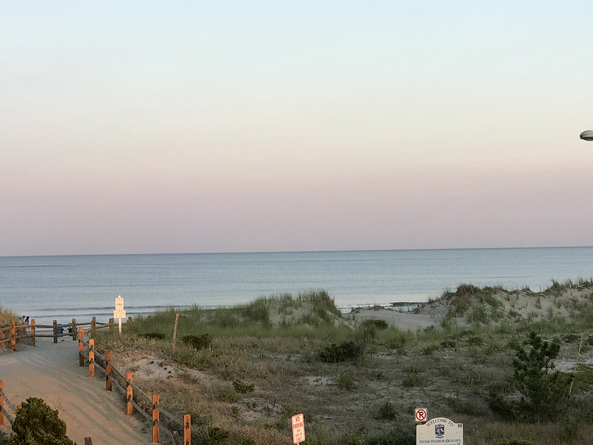
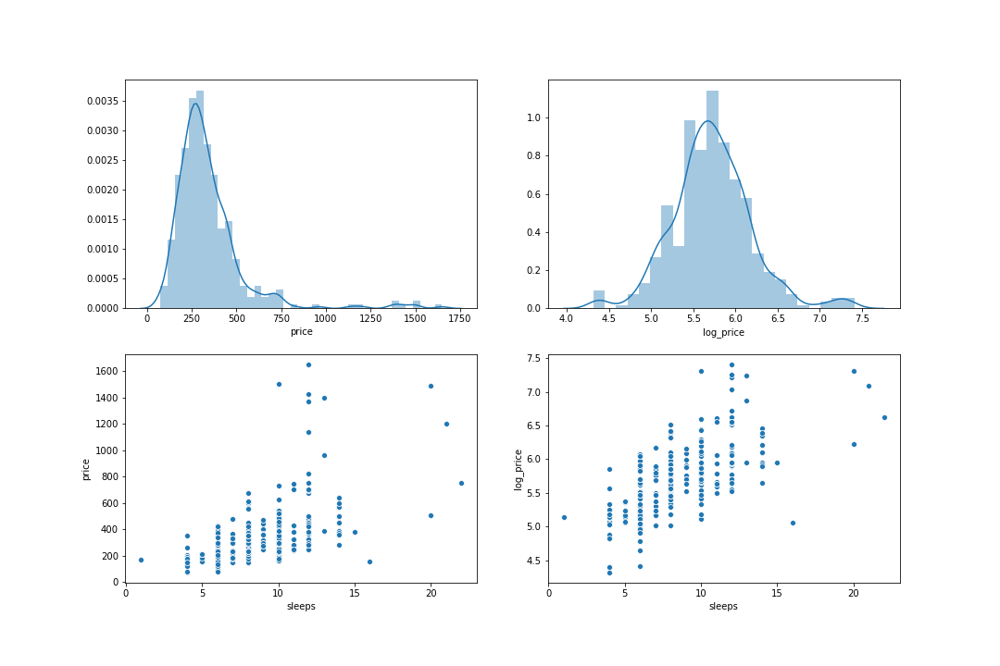

### Motivation

One of my absolute favorite places to be is at the beach!  During the summer I spend most of my weekends there and some full weeks. My happy place is and always has been Stone Harbor, a beach town on the Jersey Shore.  There are always houses on the market in Stone Harbor as there are elsewhere, and I really enjoy window shopping for houses.  As a recent college graduate, I am no where near being able to afford a house, let alone a beach house, so this time spent window shopping should probably be referred to as day dreaming instead.  But hopefully someday this day dreaming can become a reality!  As a very mathematically minded person persuing Data Science, I thought "How can I use my data science skills to help myself afford a beach house?" And that is exactly the question I plan to answer in the rest of this blog.  

### Methodology

Stone Harbor is located in Cape May County New Jersey, so this is where I focused my research, however this methodology could be used in other areas as well, given there is sufficient data available.  There are many rental platforms that exist, so I wanted to focus on just one, and used VRBO rentals.  In order to gain the data from VRBO I used Beautiful Soup and Selenium, two python packages, to web scrape some data from the VRBO website.  I then used pandas and jupyter notebook to conduct some Exploratory Data Analysis and get a better understanding of the data that was available to me.  Since the goal of this project was to predict the rental income, I used sklearn as well to create a linear regression model for these predictions.  

### Exploratory Data Analysis

Exploratory Data Analysis (EDA) is a very important part of any Data Science project.  This allows you to really understand your data before digging into the deeper more complex models.  Some problems can even be solved using just EDA alone, however as this project involved predicting prices, supervised machine learning was required for the project as well.  While doing some EDA and plotting the target and some of the features I had, I noticed that the targer variable, the thing that I want to predict (price), was right skewed.  This is a problem for linear regressions, since a big assumption of linear regressions is linearity.  This means that the relationships between the dependent and independent variable must be linear.  This shouldn't be too surprising given the name "linear regression," however it can easily be violated, and a right skewed distribution of the target variable does just that.  While this might seem like a huge problem, luckily nonlinear transformations are an easy fix to this problem. I used a log transformation on my data to fix this problem and, as you can see below, the dependent variable, price, is much more normally distributed which directly impacts the correlation between the independent variable 'sleeps.'

This emphasizes how important understanding your data is before jumping right into modeling.  However, I will jump into the model results now, as I'm sure that is more interesting. 

### Results

The final model that I ended up with had price as the target variable and five features used to predict the price.  Those features were number of bedrooms, number of bathrooms, type of property, distance to the beach, and distance to the beach squared.  Type of property is binary variable, which respresents whether the property falls into the category of house and townhouse or apartment and condo.  All of these features had a positive impact on the resulting price with the exception of distance.  This is not too shocking that the closer a property is to the beach the more its rental value will be.  However a more interesting result here is the positive coefficient on the distance squared feature.  This might seem a little harder to interpret, but this shows the diminishing returns of the distance variable.  So in other terms the difference in price for a house on the beach vs a house a 2 minute walk from the beach will be larger than the difference in price for a house that is a 12 minute walk from the beach vs one that is a 14 minute walk away.  Both of these house comparisons are 2 minutes different in the distance feature, however the further the property is from the beach, the less important that becomes.  

|               | Beds | Baths | Type  | Distance | Distance^2 | Predicted | Actual |
| ------------- | ---- | ----- | ----- | -------- | ---------- | --------- | ------ |
| Close         | 4    | 2     | Condo | 7        | 49         | $326.84   | $325   |
| Underestimate | 3    | 2.5   | House | 11       | 121        | $294.07   | $350   |
| Overestimate  | 3    | 2     | Condo | 5        | 25         | $238      | $239   |

The above table shows three example property's and how the model predictions compare to the actual rental prices.  This table represents a very close prediction, as well as an underestimate and an overestimate.  I wanted to show all three possibilities to emphasize the error that will appear in data science models, more error in some models and projects and less in others.  In order to evaluate my models I used the RMSE metric, which stands for root mean squared error.  I find this metric to be really interesting and helpful because of its interpretability.  The RMSE for my model was 105.14, which means that on average the model is off by about $105.  This is really important to know if you are planning to use the model to purchase a property.  The error could mean either the actual worth is more than predicted or that it is less than predicted, so it is imperitive to understand the error in this model, and any other model as well, before blindly deploying it. 

##### Can I Afford this House?

Since my main motivation for this project came from wanting to understand how and when I can get a beach house for myself, I wanted to provide an example of how knowing this information could be helpful for someone in the same position as I am.  Suppose the house I want to purchase will cost me $500,000 and I have a budget that limits me to $400,000, right now the house is $100,000 over my budget, which is quite a significant amount. However if I am open to renting the property for some time I can earn rental income to close that over budget gap. These two equations below might just be able to help me out.  

(1) Predicted Average Rent × # Nights = Yearly Rental Income

(2) Over Budget Amount=Number Years × (Yearly Rental Income - tax)

 Assuming I used my model to calculate the predicted rental income for my property, I can multiply that to the number of nights I think I will rent during the year (Jersey Shore houses are generally only rented during the summer months due to demand) to obtain my yearly rental income.  Plugging that value into the second equation I can solve for the number of years that I will need to rent before that over budget gap disappears.  

(1) $330 × 75 days = $24,750

(2) $100,000 = N × $24,750(1-.07)

After solving these equations for N, the number of years, I could determine that N~4.5 years.  So now I know that after only a 4.5 years I will have earned enough in rental income to make up for the amount I went over budget while purchasing the property.  

### Key Takeaways

That example was just one practical way the model can be used for someone looking to understand the affordability of a home.  However there are many more reasons to know the expected rental value of a home.  This could be really helpful for someone already planning to purchase a home but still deciding on which one.  If there is a significant difference in rental income, that might be something to think about during that decision making process.  And even for current beach home owners, it doesn't hurt to know the worth of your property, especially if you are considering a renovation of any sort that could change that value. 