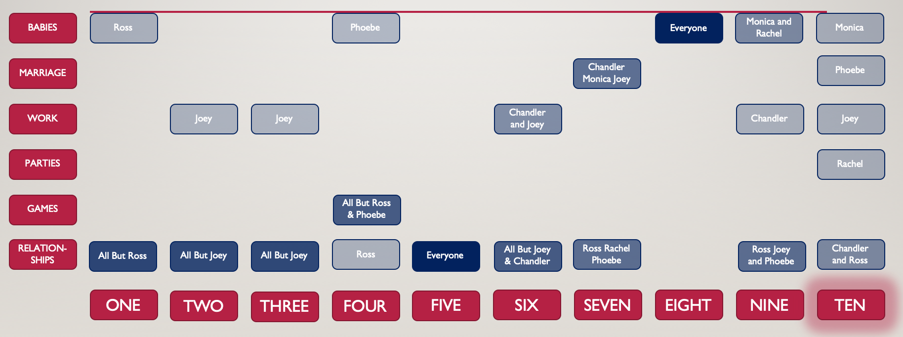

### Introduction

Anyone that knows me knows that my all time favorite TV show is *Friends*. There is just something about the show that has me smiling and laughing at each episode regardless of how many times I have seen the episode or how I was feeling prior to turning on an episode.  Luckily through Metis I found a way to combine my love for *Friends* with studying and learning Data Science.  The fourth project of the bootcamp involves using text data which allowed me to use the *Friends* transcript to analyze the TV show, and also enabled me to use conduct some research by just watching the show.  Win win for me.

### The One With the Text Data

When I was first told I had to use text data for a project I really started dreading it.  I have always been a numbers person, so I understand numbers, they come easily to me, but I could never comprehend how words and phrases could be used in a data science environment.  The answer to that question is: Natural Language Processing, generally referred to as NLP.  This technique allows  data scientists to help computers understand words and natural languages.  There are many ways this can happen, but as this project is mainly on *Friends* I don't want to spend too much time diving into them all, so I will stick with the algorithms I used to interpret the transcripts.  When you break down a document, in my case each episode of *Friends* is its own document, you end up with a bunch of words, probably lots of some words and fewer of others.  So the first step is to find all of the unique words, then those have to get turned into numbers, so that number people like me can really understand them.  There are multiple ways to do this, but the approach I took was Term Frequency-Inverse Document Frequency, also known as TF-IDF.  This tells us how often a word appears in a document relative to how many times it occurs in all of the documents being compared.  This results in a number between zero to one with a higher value for words that appear more in a document, but a lower value for words that appear in more documents overall.  For my *Friends* analysis, this would have words appearing in many episodes lose value compared to words only appearing in a few episodes, while words appearing a lot of times in an episode would have a higher value than those only appearing a couple times. This TF-IDF results in us being able to take a data frame that has multiple rows with a columnn that contains text data and turn it into a new data frame with each of those text rows now represented by numbers relating to each word. This allows us to perform some fun analysis on text data, as I did with the *Friends* transcripts.

### The One With the Topic Modeling

Okay, so now that you (hopefully) have a basic understanding of how text data can be turned into numbers, lets dive into our techniques to do so.  With this project I didn't have a specific problem that I was trying to solve or get an answer to, I really just wanted to see what I could learn from the transcripts.  When that is the case in data science we turn to unsupervised learning. The two unsupervised learning techniques are Dimensionality Reduction and Clustering.  I used both of these in this project, starting with Dimensionality Reduction.  When Dimensionality Reduction is applied on text data, the process is refered to as Topic Modeling.   The idea of Dimensionality Reduction is to take many columns and turn them into fewer columns.   This is called Topic Modeling for text data because the columns start as a bunch of words and turn into topics based on how the strongest words in the new column can be interpreted.  I used Non-Negative Matrix Factorization (NMF) in Sci-Kit Learn in python to complete the topic modeling, and the results can be seen below.

As you can see there are 8 topics, each just containing ten words.  These are the ten strongest words in each topic, so now with these words we can give each topic an appropriate name to understand the documents based on the topics they most align with.  The table below shows my labeling of the topics.

| Topic Number |  Topic Name   |
| :----------: | :-----------: |
|      0       | Relationships |
|      1       |    Babies     |
|      2       |   Marriages   |
|      3       |    Family     |
|      4       |    Parties    |
|      5       |     Work      |
|      6       |   Holidays    |
|      7       |     Games     |

Since each episode of *Friends* is a document in my project, we now have eight topics describing each epsidoe rather than thousands of words to look through. 

### The One With the Clusters

After Topic Modeling, to get an even better understanding of the show I used KMeans Clustering to put each episode into a cluster or group based on the themes of the episode.   The clustering provided me with seven groups, each one related to a topic, with relationships and family combining for one cluster.  

 

The two pictures above show how the episodes can be visualized in two dimensional space and how the different clusters interact.  The first plot shows all of the clusters present, and as you can see the relationships cluster is in the middle of everything with all of the other clusters branching off of it.  This really just emphasizes that *Friends* is a relationships based TV show first and foremost.  The second plot does not have the relationships cluster to show the remaining clusters a little more clearly.  

### The One With the Season Based Analysis

Now that the clusters have been created, I was interested to see how each season would get categorized.  This time I had each document consist of an entire season of episodes, so there were ten total documents to look at.  The results of the clusters by seaon can be seen below.

 

The clusters represented by each season really show how the series grows throughout the seasons. The beginning seasons are light hearted and just about relationships, but as the characters grow older and start thinking about settling down, the seasons themes transition into work marriage and children.  Looking at each character individually by season, you can further see how the characters differ in themes and priorities.

Each character's individual theme for each season can be seen here.  As you can see, season ten has the most variety in themes, most likely representing the characters starting to go their own ways as the series comes to an end.  

### Conclusion

As much as I could go on an on about *Friends* and continue to analyze the show forever, I only had a limited time for this project during Metis, so i had to end the analysis somewhere.  I definitely want to come back to this project at some point to continue to learn about *Friends* and the themes and topics, maybe this time see each charcter by episode rather than by season, but that will have to hold off for another day.  Thanks for reading my analysis, I hope you enjoyed learning about the latent topics in *Friends*.  